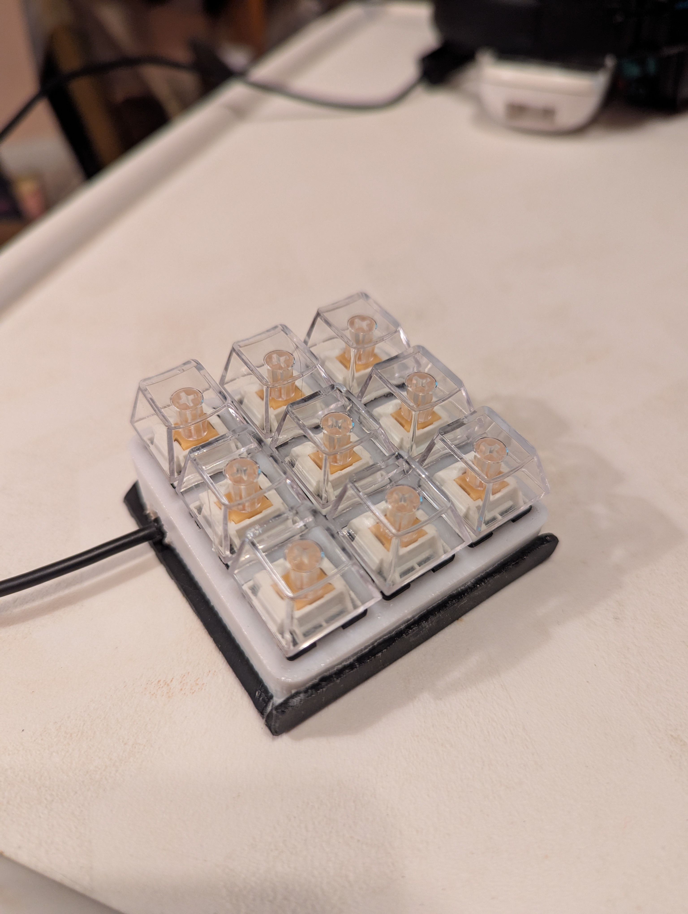

# penguin-macropad

A 3x3 macropad made from a Clackify tester, Akko switches, and an
Adafruit KB2040.

## Lessons learned

Don't use a matrix if you have enough pins for direct wiring! :)

## Construction log

Coming soon!
