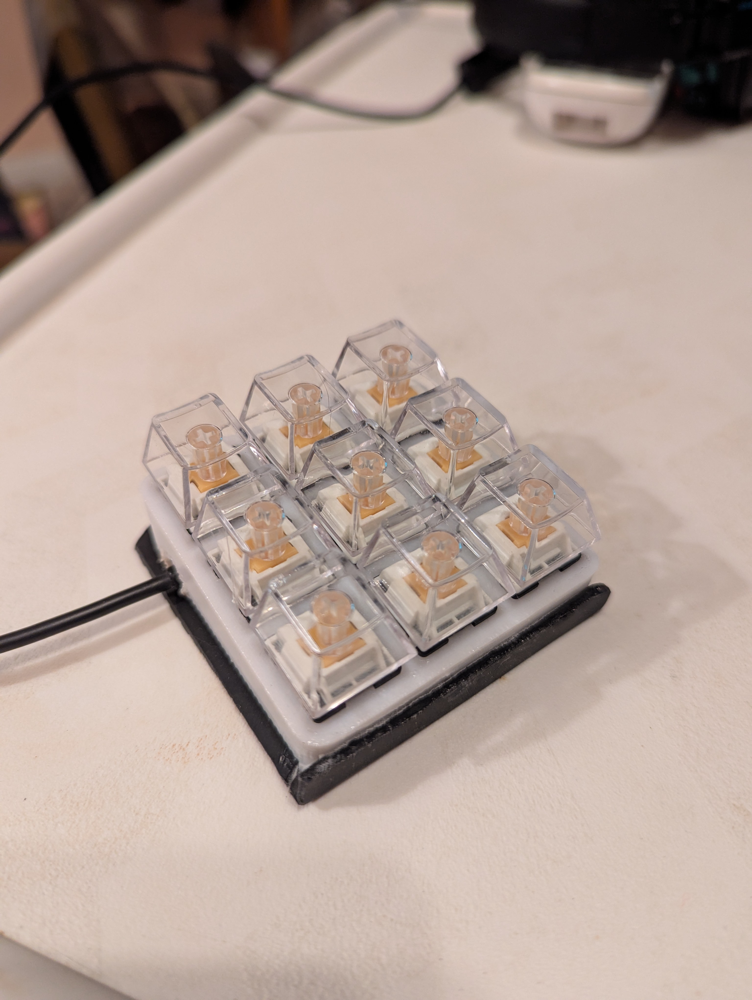
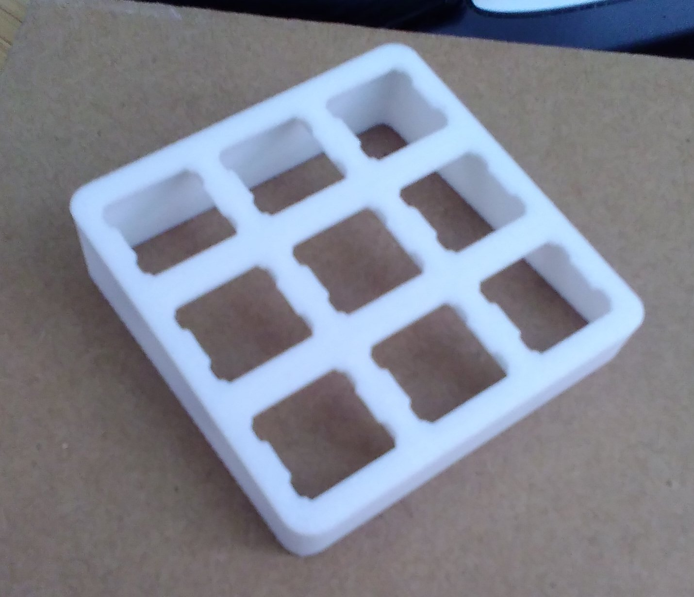
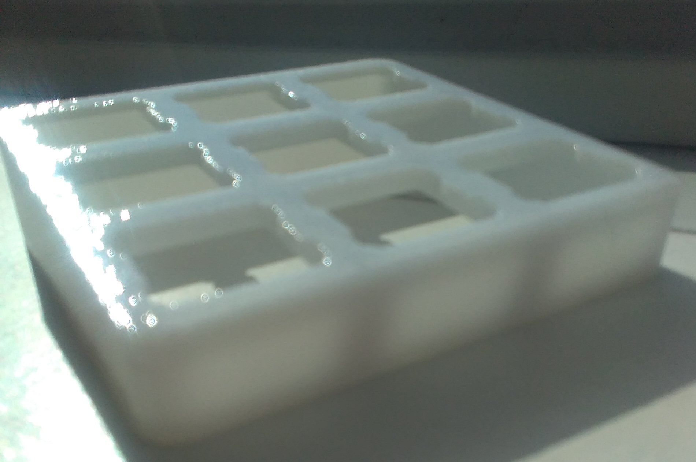
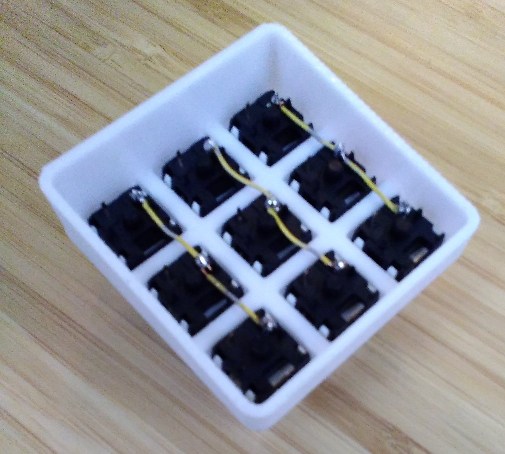
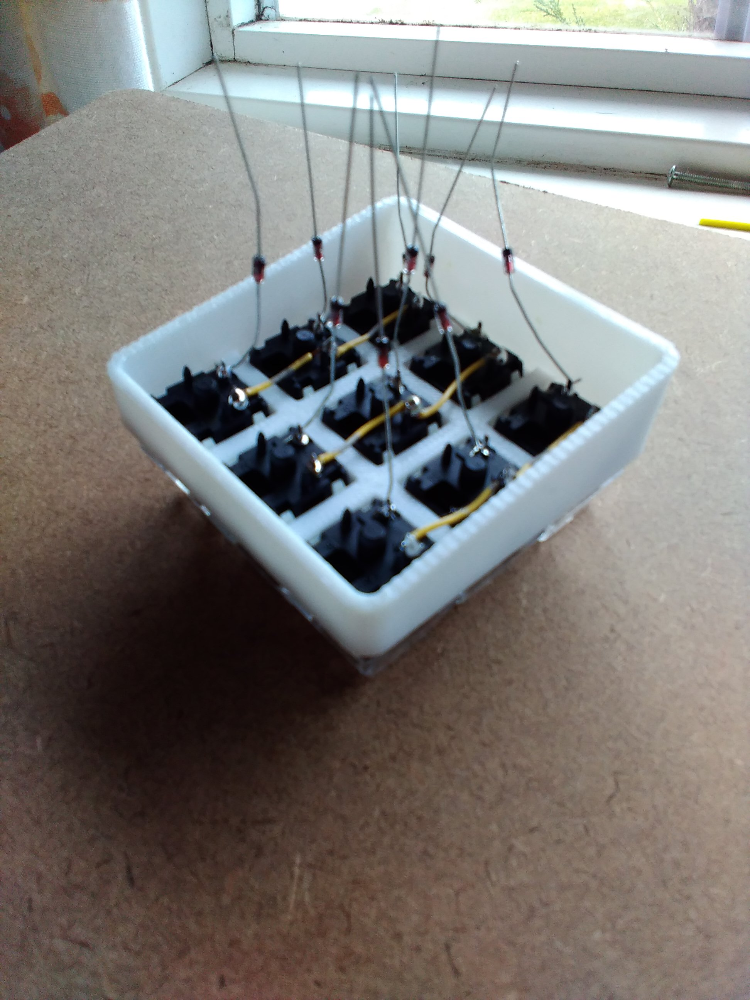
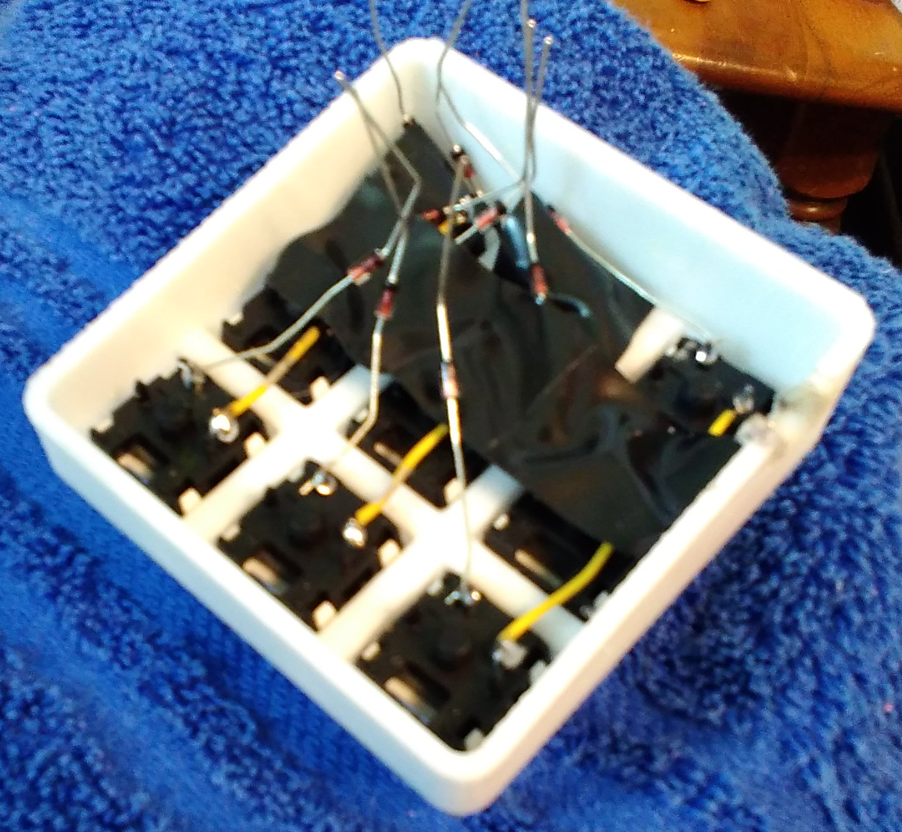
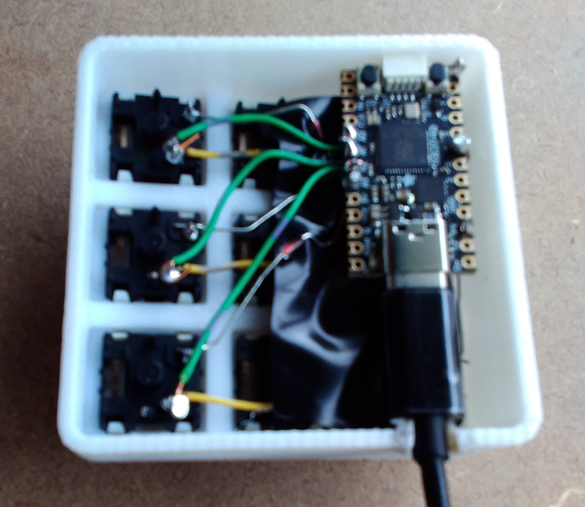
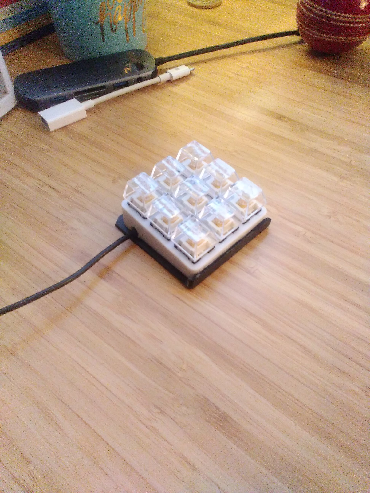

# penguin-macropad

A 3x3 macropad made from a Clackify tester, Akko switches, and an
Adafruit KB2040.

## Serial comms

I use `tio`.  `/dev/ttyACM1` 115200.  More details at
<https://learn.adafruit.com/welcome-to-circuitpython/advanced-serial-console-on-linux>

## Lessons learned

Don't use a matrix if you have enough pins for direct wiring! :)

## Construction log

(Sorry the pictures are a bit blurry!)

Start with a base.  I used the base I got with a keyswitch tester
from [Clackify](https://clackify.com/products/tester-base).

Clearcoat the base.

Add switches.  I used [Akko Penguin](https://milktooth.com/products/penguin) 
silent tactile switches from Milktooth.  These are very quiet!

Start wiring.  I had already decided to use a matrix, so I first wired
column lines.  I wired these by cutting the wires to length, stripping the 
ends, and wrapping the ends around a straightened-out paper clip.  Then I put
the resulting loop over the pin and soldered it in.

Next, wire a diode to the other terminal of each switch.

Then I used my soldering iron, set to 325 degrees, to melt a slot in the side
of the base for the USB cable.

After that I started bending the diodes over, applying electrical tape to
separate layers, so the diodes would be in the right places to connect to
the microcontroller.  I bent the diode wires to point up in the places where
the holes were on the microcontroller.

Then I put the microcontroller on top of the diode wires and soldered
them in.  Finally, I soldered wires from each column line to a respective
pin.

For a base, I cut a spare piece of rubber and super-glued it to the front
of the base.  I left the back of the base open so I can access the buttons
on the microcontroller.

